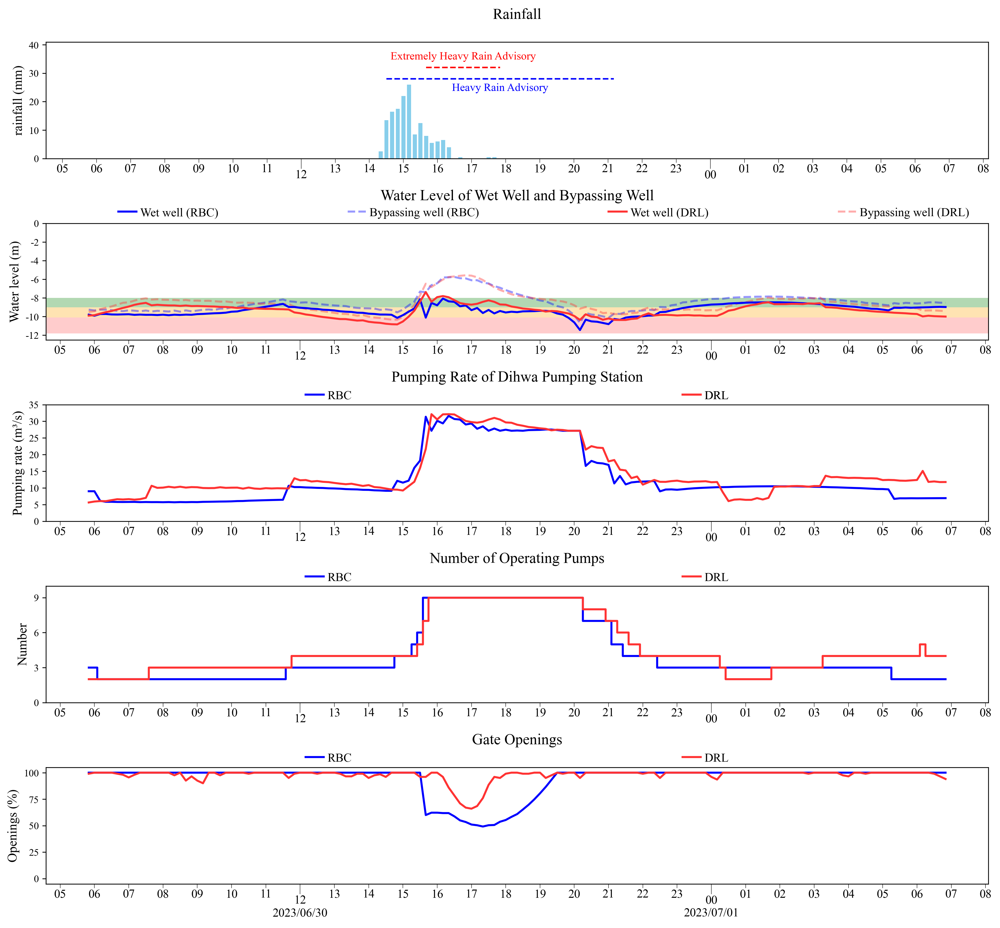

# Sewer-System-RTC

Real-time control (RTC) in urban sewer system using rule-based control and reinforcement learning method.

## **Purpose**
Due to the corroded and aging sewage pipelines, rainfall invasion to the urban sewer system seems inevitable. Therefore, sewer overflows from manholes are likely without appropriate control measures. With the burgeoning development of Internet of Things (IoT), urban sewer system can now be faciliated with sensors and activators connected through the internet so that remote and automated control is becoming increasingly feasible. Thus, this repo aims to leverage IoT technology in sewer system and develop two types of models:
- Rule-based model: leveraging predefined control rules for decision making.
- Reinforcement learning model: leveraging SAC algorithm to provide dynamic suggestions.

  
The goal is to provide operational suggestions for sewer systems and notch up decision-making to mitigate overflow risks.

## **Feature**
- Comparison between rule-based control and reinforcement learning control
- Reinforcement learning model needs to learn a policy that not only optimizes for ultimate objective but also comply with the on-site facility limitations (pumps, sumps, etc).
- Reward engineering: design the reward function for each objective and tune the weights among goals in order to ensure the effectiveness of agent's policy and optimize its performance.

### **Reward design**
The objectives includes water level objective, pump operation objective, gate operation objective and power cost objective. Among them, water level objective is the main goal which is intended to maintain the water level in a fixed range, the pump and gate operation objecctive are meant to evaluate the compliance of rules of the on-site facilities, and the power objective is for costing the power cost of operating pumps.  
- Reward design of water level objective: once the water level exceeds the acceptable range, agent will suffer from a large negative reward.
- Reward design of pump and gate operation objective: becasue sometime it's inevitable to breach the rules (e.g. the coming of surge), this part uses frequency to calculate the punishment (if the agent violate the rules more frequent then the penalty would be greater) which enables agent to infringe the rules for greater good but not too often.
- Reward design of power cost objective: due to the variability of power price, the reward is designed to be the electric power in the power of a coefficient proportional to electricity price. 

## **Results**
- Reinforcement learning demonstrates the superior adaptability and robustness
- 

  
